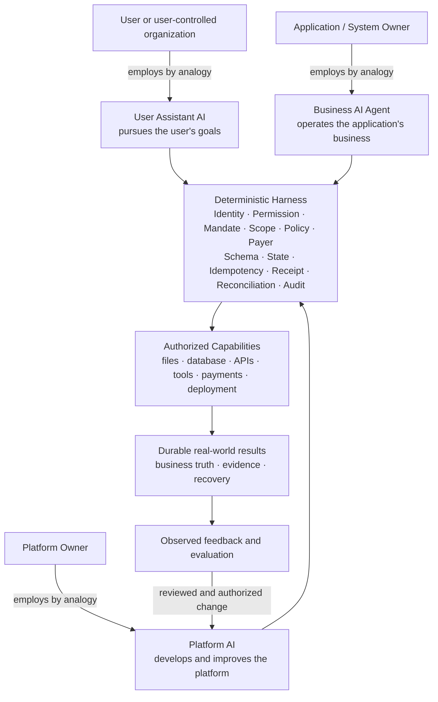
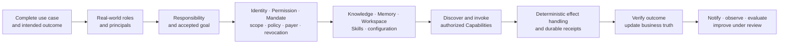
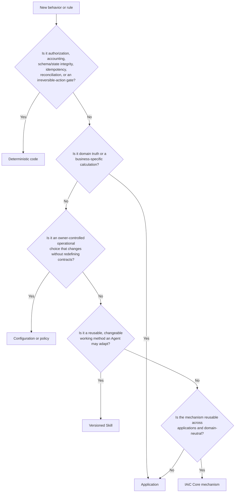
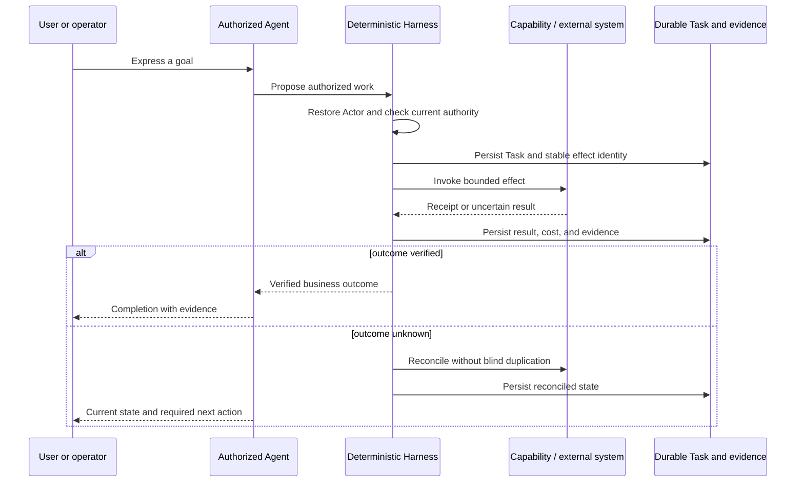
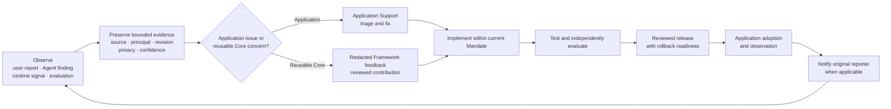

# What is an AI Native Application?

> An AI Native Application is a system in which authorized AI Agents carry responsibilities on behalf of clearly identified principals, use explicit capabilities and persistent resources to pursue goals, and operate inside a deterministic Harness that preserves authority, business truth, durable state, evidence, recovery, and accountable evolution.

This is IAiC Core's canonical conceptual definition. It is a design contract for application owners, human developers, AI developers, and Core contributors—not a claim that every mechanism described here is already complete.

## The quick design test

An application is not AI Native merely because it has a chat interface or calls a model. It must make six things explicit:

1. **Principal:** whose interests and responsibilities the Agent represents.
2. **Authority:** which current identity, Permission, Mandate, scope, policy, payer, and revocation rules allow an action.
3. **Capability:** which bounded interface may perform or observe an effect.
4. **Harness:** which deterministic mechanisms protect state, money, irreversible actions, recovery, and audit.
5. **Evidence:** what independently demonstrates that the intended outcome actually happened.
6. **Evolution:** how observed problems improve Skills, Capabilities, Harness, or code without silently widening authority.

If any of these is implicit, the design is incomplete.

## The system at a glance

Each Agent role is classified by represented responsibility—not by model provider, task duration, deployment location, UI channel, or the business object being handled.

The word “employee” is an explanatory analogy. It identifies whose interests and responsibilities the Agent represents; it does not create employment, legal agency, or authority.

> **Role does not grant authority.** The same role can have different authority in different Tasks, and the same person can act for different principals. Every operation still uses one explicit Actor context.

## Terms used in this definition

- A **principal** is the person or organization whose interests and responsibilities are represented.
- An **Actor** is the authenticated operating identity used for a specific action.
- An **Agent** is a persistent working subject configured with a responsibility, goals, resources, and authorized ways to act; it is more than one model call or chat response.
- A **Capability** is a bounded, discoverable interface with an input, output, effect, authorization decision, and result semantics.
- A **Skill** is a versioned, reusable working method that an authorized Agent may select and adapt. A Skill is not authority or business truth.
- The **Harness** is the deterministic application machinery around AI reasoning: identity, permissions, Mandates, schemas, state transitions, durable work, effects, money controls, receipts, reconciliation, audit, and recovery.
- A **Permission** allows a class of action; a **Mandate** authorizes responsibility and boundaries for a particular purpose. Both are current and revocable.
- A **Task** is accepted durable work whose lifecycle is independent of one conversation connection.
- **Evidence** is a retained observation, receipt, artifact, or verification result that supports a claim without becoming authority merely because it was submitted.

## Three responsibilities, three represented interests

| Agent role | Whose interests it represents | Responsibility | Typical authorized resources | It must not infer |
| --- | --- | --- | --- | --- |
| **User Assistant AI** | An authenticated individual or user-controlled organization | Pursue that user's goals, consume or provide services, and continue accepted user work | User permissions, private Workspace, authorized local or external resources, and user payment, order, comparison, or reporting capabilities | Platform internals, another user's data, or System Owner authority |
| **Business AI Agent** | Application or System Owner | Execute the application's business responsibilities and keep its business processes operating | Server capabilities, application databases, system configuration, third-party adapters, system model, and system budget | Authority merely because a business object or service is involved |
| **Platform AI** | Platform Owner | Develop, maintain, evaluate, release, observe, recover, and improve the platform and reusable capabilities | Source repository, tests, evaluations, deployments, and observability tools within its current Mandate | Unreviewed source or deployment rights, or authority embedded in feedback |

An organization assistant can still be a User Assistant AI when it works for that organization. A logistics, order, or content Agent is not automatically Business AI: classification depends on whose responsibility it carries.

## Design from the business outcome inward

Start with complete use cases and the real-world roles required to finish them. Then decide which responsibilities belong to User Assistant AI, Business AI Agent, Platform AI, deterministic application code, or a human.

Every arrow is a contract boundary. A model statement is not proof of an effect. A capability receipt is not proof of business success. A submitted request is not an accepted order. A payment intent is not settlement. An evaluation is not a release.

## AI reasoning and the deterministic Harness

AI and deterministic code have complementary responsibilities. Moving an invariant into a longer prompt does not make it safe.

```mermaid
flowchart LR
  subgraph AI["AI reasoning — probabilistic"]
    A1["Interpret goals"]
    A2["Gather authorized context"]
    A3["Ask bounded questions"]
    A4["Select Skills and Capabilities"]
    A5["Plan, compare, adapt"]
    A6["Summarize evidence and propose change"]
  end

  subgraph DH["Deterministic Harness — enforced"]
    H1["Authenticate Actor"]
    H2["Check Permission, Mandate,<br/>scope, policy, payer, revocation"]
    H3["Validate schemas and visibility"]
    H4["Persist Task, state, effect,<br/>cost, evidence, revision"]
    H5["Enforce idempotency, concurrency,<br/>timeouts, retries, cancellation"]
    H6["Protect money and irreversible actions"]
    H7["Reconcile unknown outcomes"]
    H8["Verify before advancing business truth"]
  end

  A1 --> A2 --> A3 --> A4 --> A5
  A4 -->|proposal| H1
  H1 --> H2 --> H3 --> H4 --> H5 --> H6 --> H7 --> H8
  H8 -->|observed result| A5
  A5 --> A6
```

Deterministic does not mean that every business workflow is hard-coded. It means that trust boundaries and stable invariants remain enforceable, observable, and recoverable even when reasoning is probabilistic.

## Where should behavior live?

Use this placement test before adding a prompt, Skill, policy, application feature, or Core primitive.

The placement can change as evidence accumulates, but the owner, revision, migration, tests, and authority boundary must remain explicit.

## Responsibility persists beyond chat

Closing a page, messaging channel, or model connection does not cancel accepted work. An AI Native Application separates interaction from durable responsibility.

The Task, effect identity, evidence, and current authority make safe continuation and recovery possible. Conversation history alone does not.

## External Agents remain first-class participants

An application-provided Assistant and an external personal Agent may use the same authorized application capabilities through API, MCP, A2A, or another adapter. The external Agent does not need to adopt IAiC Core Runtime or transfer its inference into the application.

The application still owns authentication, Actor mapping, tool visibility, authorization, input validation, stable write keys, receipts, business truth, and result semantics at every adapter. An installed Skill can explain when and how to use the application, but it cannot grant access.

## Accountable evolution

An AI Native Application should learn from operation. It must not silently rewrite trusted behavior from a user comment or an Agent's suspicion.

Feedback is untrusted evidence, not executable instruction or an authority grant. Platform AI may diagnose, implement, evaluate, release, or notify only through its current Mandate and repository controls. Application adoption is separate from a Core release.

## Minimum design review for contributors

Before presenting a design as AI Native, answer all twelve questions:

1. What complete use case or business outcome is being supported?
2. Which real-world roles participate, and which principal does each Agent represent?
3. What responsibility remains accepted after the conversation closes?
4. Which identities, Permissions, Mandates, resource scopes, payers, policies, and revocation rules apply?
5. Which facts and calculations are authoritative, and who owns them?
6. Which Capabilities may be discovered and invoked, through which interfaces?
7. Which working methods belong in Skills or configuration, and which invariants must be deterministic code?
8. What durable Task, Session, Workspace, effect, cost, and evidence records are required?
9. How are unknown outcomes reconciled without blind duplicate effects?
10. What independently verifiable evidence proves completion?
11. How can users and Agents report problems, and how does Platform AI improve the system without widening authority?
12. What belongs in reusable Core versus the application?

A proposal that cannot answer these questions is incomplete, even if its chat demonstration looks intelligent.

## What is not sufficient

- A chat UI placed in front of unchanged forms is not automatically AI Native.
- A model with unrestricted internal API access is an authority failure, not an Agent architecture.
- Business invariants embedded only in a prompt are not deterministic controls.
- An autonomous loop without stable identity, durable receipts, recovery, evaluation, and revocation is not trusted application operation.
- Calling every service-specific automation a Business AI confuses a business object with represented responsibility.
- Treating a successful tool invocation as verified business completion confuses transport with outcome.
- Silently mutating prompts or Skills from feedback is not accountable evolution.
- Requiring every external personal Agent to adopt Core Runtime is unnecessary for interoperability.

## Responsibility boundary

Applications own domain truth, business rules and calculations, identity mapping, Capability implementations, configuration, sharing policy, adapters, deployment, and UI/UX. IAiC Core supplies reusable contracts and domain-neutral mechanisms; it does not prescribe industries, departments, or fixed workflows.

This definition does not grant authority, change Runtime behavior, prove production adoption, or establish that every required Core capability has passed acceptance.

## Continue from here

- Read [Core requirements](CORE_REQUIREMENTS.md) for the technical delivery target.
- Read [Acceptance](ACCEPTANCE.md) for requirement-to-evidence mapping.
- Read [Status](STATUS.md) for current implementation and known limitations.
- Use [Getting Started](GETTING_STARTED.md) to compose an application.
- Use [Framework Feedback](FRAMEWORK_FEEDBACK.md) to contribute a reusable, redacted Core finding.
